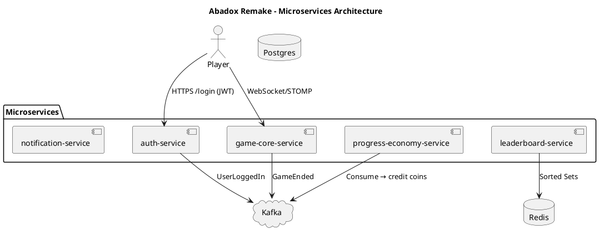

# Dron Wars Org – Portfolio Projects

Welcome to **dron-wars-org** – my personal organization for full-stack, game-dev, and experimental projects.

Here I build modern, scalable applications to refresh rusty concepts, learn the latest Java 21+ features, and create demo-ready portfolio pieces for senior-level interviews.

Current flagship project: **Abadox NES Remake**  
A modern browser remake of the classic NES horizontal shmup *Abadox* (1989), enhanced with persistent power-ups, virtual economy, real-time leaderboards, and optional co-op mode — all built with microservices and event-driven architecture.

**Why this name?** "Dron Wars" sounds cool, futuristic, and game-related — perfect for a dev org that includes shooters and real-time systems.

## Current Projects

### Abadox NES Remake (Main Project)
A senior-level full-stack portfolio showcasing:
- **Frontend**: Phaser 3 game engine + HTML5 Gamepad API (joystick support)
- **Backend**: Event-driven microservices with Spring Boot 3.x / Java 21
- **Real-time**: WebSockets/STOMP + Kafka messaging
- **Persistence**: PostgreSQL + Redis caching
- **Security**: JWT + OAuth2
- **Infra**: Docker Compose for local dev (Postgres, Redis, Kafka)

#### Microservices (in progress)
- **[auth-service](https://github.com/dron-wars-org/auth-service)**  
  First microservice – handles registration, login, JWT issuance, refresh tokens, OAuth2 (Google), and user profiles.  
  Features: Virtual threads, Kafka producers for user events, Redis sessions.

More services coming soon:
- game-core-service (real-time game logic & WebSockets)
- progress-economy-service (scores, wallet, shop)
- leaderboard-service (Redis Sorted Sets)
- notification-service (emails & push via Kafka)

### Architecture Overview

*(Render live at https://editor.plantuml.com/ – paste from docs/architecture.puml)*

## Tech Stack Highlights (Learning Focus)

- **Java 21+**: Records, sealed classes, pattern matching, virtual threads (Project Loom), scoped values
- **Spring Boot 3.x**: WebFlux/Netty, Micrometer observability, AOT/GraalVM hints
- **Kafka**: Event-driven decoupling (producers/consumers/streams)
- **Redis**: Sessions, game state cache, real-time leaderboards
- **Phaser 3**: 60 FPS shmup with object pooling & gamepad support
- **Testing**: JUnit 5, Testcontainers (Postgres/Redis/Kafka), integration tests
- **DevOps**: Docker Compose, GitHub Actions CI/CD

## How to Explore / Contribute

1. Clone any repo:  
   `git clone https://github.com/dron-wars-org/auth-service.git`

2. Local setup (for Abadox main project – coming soon):  
   See individual repo READMEs or the monorepo structure (planned).

3. Want to collaborate or give feedback?  
   Open an issue or PR – always welcome!

## Goals & Motivation

This org exists to:
- Refresh 10+ years of experience with modern Java/Spring
- Build something fun (shmup with joystick!) while learning seriously
- Create interview-ready demos that show architecture depth (not just CRUD)

"Code by night, slay bosses by joystick" – Don Torcuato, Buenos Aires, 2026

---

MIT License – fork, play, learn, enjoy!
